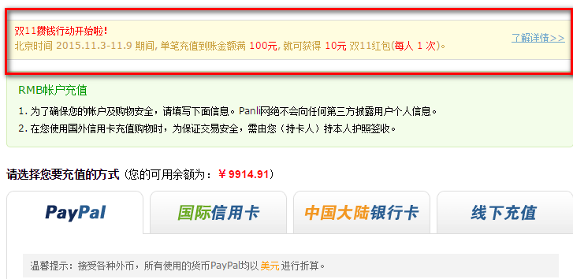
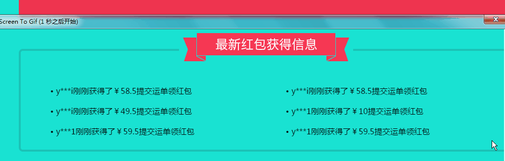
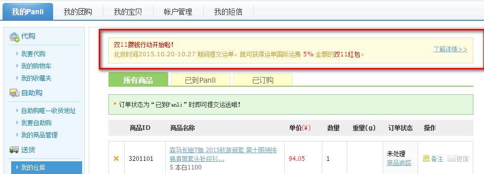
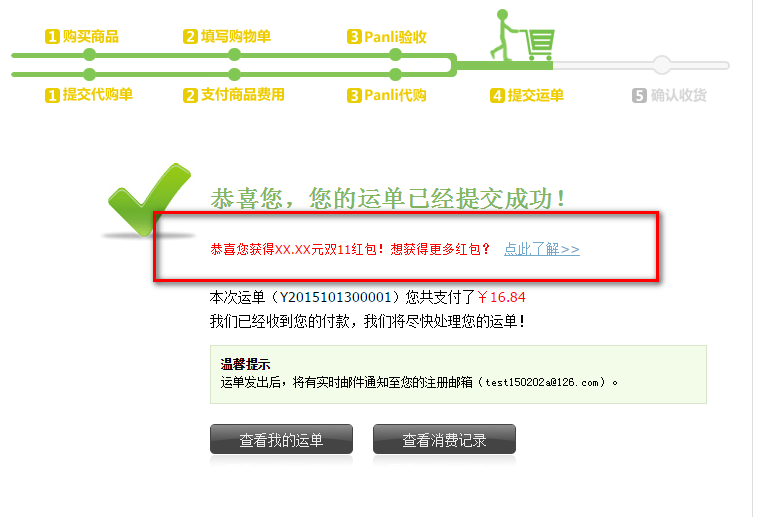
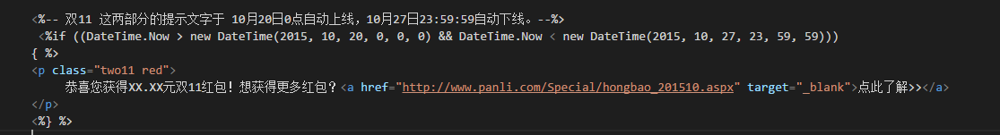

## 一个工作提交日志 10月份

## 2015年10月27日17:40:36

我的仓库 改为  我的购物车

### 需要更新获取的文件

>/oldsite/mypanli/ShoppingCart.aspx

### code update

```
<div class="weizhi">
  <b>您的位置：</b><a href="/mypanli/">我的Panli</a><span>&gt;</span>我的购物车
</div>
```

## 2015年10月26日12:51:42

#### 需求
>定时10月27日0:00—11月3日0:00，有弹出蒙版宣传页。活动期间用户每天打开首页，只弹1次。弹窗设计请查收附件。
>弹出框链接： http://www.panli.com/Special/hongbao_201510.aspx （记得做成整个弹窗图片都可以链接到活动页）


### 需要更新获取的文件 --  新建立跟目录文件夹 Pc

>Panli.Site.Static/Pc/index/images/doing_001.png

>Panli.Site.Static/FrontEnd/js20090801/NewIndex/topBanner.js


### code update

```
//定时10月27日0:00—11月3日0:00，有弹出蒙版宣传页。活动期间用户每天打开首页，只弹1次。弹窗设计请查收附件。
//弹出框链接： http://www.panli.com/Special/hongbao_201510.aspx （记得做成整个弹窗图片都可以链接到活动页）
new bannerSpecial('Special13', new Date(2015, 9, 27, 8), new Date(2015, 11, 3, 8), new Date(date), function () {
   var _ImgW = 507,
       _ImgH = 554,
       _closeAR = 40,
       _closeAT = -9,
       _imgSrc = 'http://sf.panli.com/UX/pc/index/images/doing_001.png',
       _aHref = 'http://www.panli.com/Special/hongbao_201510.aspx';
   var Special10 = $('<div class="Special10" style="width:' + _ImgW + 'px; height:' + _ImgH + 'px; background:url(' + _imgSrc + '); position:fixed; left:50%; top:50%; margin-left:-' + _ImgW / 2 + 'px; margin-top:-' + _ImgH / 2 + 'px; z-index:9999;"><a href="javascript:;" class="SpecialClose" style="display:block; width:60px; height:60px; position:absolute; right:' + _closeAR + 'px; top:' + _closeAT + 'px;z-index:12;"></a><a href="' + _aHref + '" style="display:block; width:' + _ImgW + 'px; height:' + _ImgH + 'px;  position:absolute; left:0px; bottom:0px;z-index:10;"></a></div>');
   $('body').prepend(Special10);
   Panli.Overlay.open();
   Special10.find('.SpecialClose').click(function () {
       Panli.Overlay.close();
       Special10.remove();
       return false;
   });
});
```

---


## 2015年10月22日09:41:04

PC 首页 双十一主题LOGO 和 倒数计时
> 主题LOGO ：11月1日0点上线，11月11日 23：59：59 下线
> 双11 倒计时： 11月11日0点 上线：23：59：59：下线

### 需要更新获取的文件
1. http://localhost:45419/Panli.Site.Static/Ued/images/20151001/  目录下所有文件
2. http://localhost:58251/oldsite/master/NewsMain.master    // 母版文件

### code update
```
<%--2015 1111 logo 活动--%>
<%if (DateTime.Now > new DateTime(2015, 11, 11, 0, 0, 0) && DateTime.Now < new DateTime(2015, 11, 11, 23, 59, 59))
        { %>
   <div class="fl logo dual-october-wrap">
       <a href="http://www.panli.com">
          
           <div id="dual-october-time" class="dual-october-time-1">
              <div id="dual-text-time" class="dual-text-time"></div>
           </div>
       </a>
   </div>
<%} else if (DateTime.Now > new DateTime(2015, 11, 1, 0, 0, 0) && DateTime.Now < new DateTime(2015, 11, 11, 0, 0, 0))
  {%>

  <div class="fl logo dual-october-wrap">
       <a href="http://www.panli.com"></a>
   </div>

 <%

 }else %>

<% { %>

  <div class="fl logo">
       <a href="http://www.panli.com"></a>
   </div>

<%} %>
```

#### 运营说 logo 主题可以直接上
>logo 时间改为如下

```
2015, 10, 22, 0, 0, 0
```
---

> 已经完成的 以下忽略
更新获取的文件
http://localhost:45419/Panli.Site.Static/Ued/images/index/logo1111.gif


## 2015年10月21日11:56:56

双11红包 h5 滚动 同步 PC

http://www.panli.com/Special/hongbao_201510_m.aspx

### 需要更新获取的文件
1. http://localhost:58251/oldsite/Special/hongbao_201510_m.aspx
2. http://localhost:45419/Panli.Site.Static/Ued/Special/20151015h5/js/main.min.js

## 2015年10月21日09:11:37

关于商品抓取页面信息 规格不显示 问题？
> 凡是当当网抓取的信息 页面信息规格被隐藏删除了 是由于 json数据里面的匹配 数量为0导致的
测试如下页面：

### 同样一件商品测试  -- 2015新款李宁智能跑鞋 赤兔女子透气跑步鞋
* 天猫商城        页面正常    demo 演示 http://page.mu.gg/20151021/
* 当当网          页面不正常  demo 演示 http://page.mu.gg/20151021/dang.html
* 修改后的当当网   页面正常    demo 演示 http://page.mu.gg/20151021/dang2.html

### 测试数据如下

当当网抓取的数据 如下
```
{
  "CombinationId": "1274854444",
  "Price": 399,
  "Promo_Price": 199,
  "Quantity": 0,
  "SkuIds": [
      "亮水蓝+荧光粉绿",
      "35.5"
  ]
},
{
    "CombinationId": "1274854544",
    "Price": 399,
    "Promo_Price": 199,
    "Quantity": 0,
    "SkuIds": [
        "亮水蓝+荧光粉绿",
        "35"
    ]
},
```

可以看到 `Quantity` 都为零; 数量都为零;而正常访问当当网的数量是有的;
不知道是否抓取当当网的产品数量有误。

---


## 2015年10月20日15:33:18

pc 端的手机版页面

>http://www.panli.com/Mobile/Index.aspx

### 需要更新获取的文件
1. http://localhost:45419/Panli.Site.Static/Ued/images/mobile/
2. http://localhost:58251/oldsite/Mobile/Index.aspx

### demo 演示站

http://page.mu.gg/20151020/

主要更新代码
```
<div class="floor-4" data-scroll="true">
    <div class="floor-text"></div>
    <div class="floor-4-anmi">
      <div class="floor-phone"></div>
      <div class="floor-4-1 floor-4-1-anmi"></div>
      <div class="floor-4-2 floor-4-2-anmi"></div>
      <div class="floor-4-3 floor-4-3-anmi"></div>
      <div class="floor-4-4 floor-4-4-anmi"></div>
    </div>
 </div>
```

---

### 2015年10月19日 17:20:40

定时10月20日0:00—10月28日0:00，有弹出蒙版宣传页

签入文件
1. http://localhost:45419/Panli.Site.Static/FrontEnd/js20090801/NewIndex/topBanner.js
2. >http://localhost:45419/Panli.Site.Static/Ued/images/20150927/doing_007.png


#### coding
```
//定时10月20日0:00—10月28日0:00
new bannerSpecial('Special13', new Date(2015, 9, 20), new Date(2015, 9, 28), new Date(date), function () {
    var Special10 = $('<div class="Special10" style="width:507px; height:543px; background:url(http://sf.panli.com/Ued/images/20150927/doing_007.png); position:fixed; left:50%; top:50%; margin-left:-253.5px; margin-top:-271.5px; z-index:9999;"><a href="javascript:;" class="SpecialClose" style="display:block; width:60px; height:60px; position:absolute; right:40px; top:51px;z-index:12;"></a><a href="http://www.panli.com/Special/hongbao_201510.aspx" style="display:block; width:507px; height:543px;  position:absolute; left:0px; bottom:0px;z-index:10;"></a></div>');
    $('body').prepend(Special10);
    Panli.Overlay.open();
    Special10.find('.SpecialClose').click(function () {
        Panli.Overlay.close();
        Special10.remove();
        return false;
    });
});
```


### 2015年10月19日11:43:31

请安排按照时间更新登录页、注册页左侧Banner  http://passport.panli.com/Login.aspx

展示时间：2015年10月20日0:00——11月11日23:59

活动结束后，请恢复原来的Banner。

签入文件

1. E:\panli\Panli.com\Panli.Site.Passport\Login.aspx
2. E:\panli\Panli.com\Panli.Site.Passport\Register\Default.aspx
3. http://localhost:45419/Panli.Site.Static/Ued/images/login/banner/banner.png

#### coding

```
<%if (DateTime.Now > new DateTime(2015, 10, 20, 0, 0, 0) && DateTime.Now < new DateTime(2015, 11, 11, 23, 59, 59))
   { %>
 <div class="ban01" style="background-image: url(http://sf.panli.com/Ued/images/login/banner/banner.png);">
 </div>
 <%}
   else
   { %>
 <div class="ban01" style="background-image: url(http://sf.panli.com/FrontEnd/images20090801/login/banner/login.jpg);">
 </div>
 <%} %>
```

增加图片


试图如下


### 2015年10月16日17:41:27
需求文档 ：[https://www.zybuluo.com/jean/note/191545#二充值送双11红包](https://www.zybuluo.com/jean/note/191545#二充值送双11红包)
>充值送双11红包

红色区域为添加部分



签入
1. http://localhost:58251/oldsite/mypanli/Account/pay.aspx
#### coding
> style

```
.red{
  color:Red;
}
.two11{
  border:1px solid #d9d9d9;
  background:#fffde0;
  padding: 5px 10px;
  margin-bottom:14px;
  position:relative;
}
.two11 p{
  line-height:24px;
  color:#caa13f;
}
.two11 a{
  color:#73a9cd;
  top:10px;
  position:absolute;
  right:10px;
}
.two11 a:hover{
  text-decoration: none;
}
```
> html

```
<%-- 这部分的提示文字于 11月3日0点自动上线，11月9日23:59:59自动下线。。--%>
  <%if ((DateTime.Now > new DateTime(2015, 11, 3, 0, 0, 0) && DateTime.Now < new DateTime(2015, 11, 9, 23, 59, 59)))
{ %>
    <div class="two11">
        <span class="red">
        双11攒钱行动开始啦！
        </span>
        <p>
        北京时间 2015.11.3-11.9 期间, 单笔充值到账金额满 <span class="red">100元</span>, 就可获得 <span class="red">10元</span> 双11红包(<span class="red">每人 1 次</span>)。

         <a href="http://www.panli.com/Special/hongbao_201510.aspx" target="_blank">了解详情>></a>
        </p>           
    </div>        
<%} %>
```

### 2015年10月16日09:38:09
> 双11 H5页面

[http://ps.mu.gg/20151015h5/](http://ps.mu.gg/20151015h5/)


签入
1. http://localhost:58251/oldsite/Special/hongbao_201511_m.aspx
2. http://localhost:45419/Panli.Site.Static/Ued/Special/20151015h5/


### 2015年10月15日09:22:16
>双十一 滚动



签入
1. http://localhost:45419/Panli.Site.Static/Ued/Special/20151014/js/main.min.js
2. http://localhost:45419/Panli.Site.Static/Ued/Special/20151014/main.min.css
3. http://localhost:58251/oldsite/Special/hongbao_201511.aspx


### 2015年10月14日10:28:02

最后1天的弹框图片请查收附件，是10月15日0:00—10月16日0:00弹的

提交签入
1. http://localhost:45419/Panli.Site.Static/FrontEnd/js20090801/NewIndex/topBanner.js
2. http://localhost:45419/Panli.Site.Static/Ued/images/20150927/


```
//最后1天的弹框，是10月15日0:00—10月16日0:00弹的
  new bannerSpecial('Special13', new Date(2015, 9, 10, 15,8), new Date(2015, 9, 16,8), new Date(date), function () {
      var Special10 = $('<div class="Special10" style="width:672px; height:480px; background:url(http://sf.panli.com/Ued/images/20150927/doing_006.png); position:fixed; left:50%; top:50%; margin-left:-336px; margin-top:-240px; z-index:9999;"><a href="javascript:;" class="SpecialClose" style="display:block; width:60px; height:60px; position:absolute; right:-9px; top:169px;z-index:12;"></a><a href="http://www.panli.com/Special/sale_201510.aspx" style="display:block; width:672px; height:480px; position:absolute; left:0px; bottom:0px;z-index:10;"></a></div>');
      $('body').prepend(Special10);
      Panli.Overlay.open();
      Special10.find('.SpecialClose').click(function () {
          Panli.Overlay.close();
          Special10.remove();
          return false;
      });
  });
```


### 2015年10月13日10:22:29

双11 这两部分的提示文字于 10月20日0点自动上线，10月27日23:59:59自动下线。

红色画圈为新增部分

http://www.panli.com/mypanli/OrderCart.aspx




http://www.panli.com/mypanli/DeliverType/OrderSuccess.aspx?t=1


提交签入
1. http://www.panli.com/mypanli/DeliverType/OrderSuccess.aspx?t=1
2. http://www.panli.com/mypanli/OrderCart.aspx

#### 需要后台修改
>红包金额(图中XX.XX元) = 实际支付 的，不含报关费 的 国际运费的5%



```
<%-- 双11 这两部分的提示文字于 10月20日0点自动上线，10月27日23:59:59自动下线。--%>
 <%if ((DateTime.Now > new DateTime(2015, 10, 20, 0, 0, 0) && DateTime.Now < new DateTime(2015, 10, 27, 23, 59, 59)))
{ %>
<p class="two11 red">
     恭喜您获得XX.XX元双11红包！想获得更多红包？<a href="http://www.panli.com/Special/hongbao_201510.aspx" target="_blank">点此了解>></a>
</p>
<%} %>
```

### 2015年10月9日13:11:02

定时10月10日10:00—10月15日0:00，有弹出蒙版宣传页。活动期间用户每天打开首页，只弹1次。
弹出框链接：http://www.panli.com/Special/sale_201510.aspx  （记得做成整个弹窗图片都可以链接到活动页）


提交签入
1. http://localhost:45419/Panli.Site.Static/FrontEnd/js20090801/NewIndex/topBanner.js
2. http://localhost:45419/Panli.Site.Static/Ued/images/20150927/
