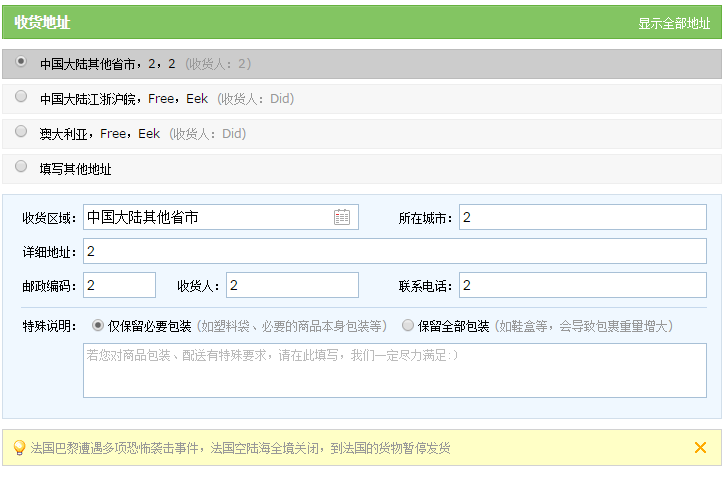
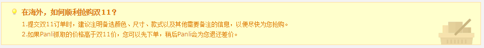
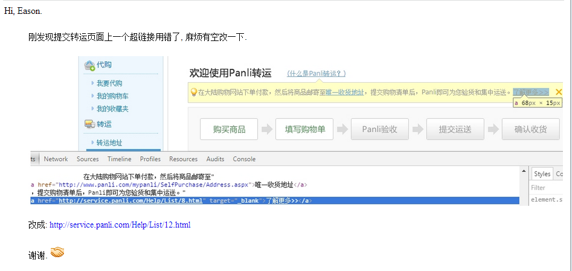
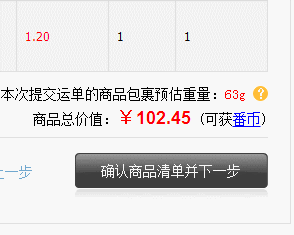

## 一个工作提交日志 11月份

## 2015年11月18日09:47:22
>法国巴黎事件提示信息

### 签入文件

1. http://localhost:1731/oldsite/mypanli/OrderList.aspx
2. http://localhost:58251/oldsite/mypanli/DeliverType/DeliverShipOrderAddress.aspx




### code


/mypanli/OrderList.aspx

```html
<div class="am_tsgai" style="margin-top:20px;" >
    <p>法国巴黎遭遇多项恐怖袭击事件，法国空陆海全境关闭，到法国的货物暂停发货。</p>
    <a title="关闭" class="gb" href="javascript:;" onclick="$('.am_tsgai').remove()" > </a>
</div>
```

/mypanli/DeliverType/DeliverShipOrderAddress.aspx
```html
<div class="am_tsgai" <%= HasLastPickShip ? "style=\"display:none;clear:both;\"" : "style=\"clear:both;\"" %>>
    <p>
      法国巴黎遭遇多项恐怖袭击事件，法国空陆海全境关闭，到法国的货物暂停发货。
    </p>
    <a title="关闭" class="gb" href="#" id="pickDeliveryTip"></a>
</div>
```

---

## 2015年11月16日09:05:57
>感恩节网站同期改动

### 签入文件 

1. http://localhost:58251/oldsite/services-rates/Default.aspx
2. http://localhost:58251/oldsite/mypanli/SelfPurchase/Order.aspx
3. http://localhost:58251/oldsite/mypanli/ShoppingCart.aspx

文件修改说明

http://www.panli.com/mypanli/ShoppingCart.aspx
>购物车面板屑 (从 "我的仓库" 改成 "购物车" )

http://www.panli.com/mypanli/SelfPurchase/Order.aspx
>"唯一收货地址" 改成 "转运仓库地址"

http://www.panli.com/services-rates/
>"唯一收货地址" 改成 "转运仓库地址"


--- 

## 2015年11月13日15:46:53
>感恩节活动-h5

### 签入文件

1. http://localhost:58251/oldsite/Special/Thanksgiving2015/H5/PaySuccess.aspx
2. http://localhost:58251/oldsite/Special/Thanksgiving2015/H5/ProductDetails.aspx
3. http://localhost:58251/oldsite/Special/Thanksgiving2015/H5/ProductList.aspx
4. http://localhost:45419/Panli.Site.Static/Ued/Special/20151111/h5/  - 新建h5 目录


### demo

[商品列表](http://panli.mu.gg/special/20151111h5/list.html)


[商品详情](http://panli.mu.gg/special/20151111h5/index.html)


[支付后](http://panli.mu.gg/special/20151111h5/index2.html)


---

## 2015年11月13日15:42:35
>我的购物车 文字修改  唯一收获地址 改成 转运仓库地址

### 签入文件

1. http://localhost:58251/oldsite/mypanli/ShoppingCart.aspx - 我的购物车 文字修改
2. http://localhost:58251/oldsite/mypanli/SelfPurchase/Order.aspx  - 唯一收获地址 改成 转运仓库地址


---

## 2015年11月13日08:56:00
>感恩节活动-pc  -- 商品列表页

### 签入文件

1. http://localhost:58251/oldsite/Special/Thanksgiving2015/PC/ProductList.aspx
2. http://localhost:45419/Panli.Site.Static/Ued/Special/20151111/css/   css 新建目录

### demo 

运营编码

---

## 2015年11月11日17:44:28
>感恩节活动-pc

### 签入文件

1. http://localhost:45419/Panli.Site.Static/Ued/Special/20151111/ 新建文件夹
2. http://localhost:58251/oldsite/Special/Thanksgiving2015/PC/PromotionPay.aspx
3. http://localhost:58251/oldsite/Special/Thanksgiving2015/PC/PaySuccess.aspx


### demo

详情页 http://panli.mu.gg/special/20151111/
支付成功页 http://panli.mu.gg/special/20151111/index2.html

---

## 2015年11月10日18:10:05

> 一键代购 增加 help 提示信息

### 签入文件

1. http://localhost:58251/oldsite/Crawler.aspx
2. http://localhost:45419/Panli.Site.Static/Ued/Pc/crawler/  新增文件夹
3. http://sf.panli.com/FrontEnd//images20090801/AddItemPanel/deng01.png  借用原来





### updateCode

```
 <div class="z-craw-help-wrap">
    <p class="z-craw-p1">在海外，如何顺利抢购双11？</p>                
    <p class="z-craw-p2">1.提交双11订单时，建议注明备选颜色、尺寸、款式以及其他需要备注的信息，以便尽快为您抢购。</p>
    <p class="z-craw-p2">2.如果Panli抓取的价格高于双11价，您可以先下单，稍后Panli会为您退还差价。</p>               
</div>
<style type="text/css">
    .z-craw-help-wrap
    {border: 1px solid #ffdda1; margin-bottom: 10px; padding-bottom:10px;background: #ffffcc url(http://sf.panli.com/Ued/Pc/crawler/images/crawler-help-bg.png) no-repeat 865px 32px;}
        .z-craw-p1{
                line-height: 38px; padding-left: 40px; background: url(http://sf.panli.com/FrontEnd//images20090801/AddItemPanel/deng01.png) no-repeat 21px 12px;
                height: 33px; color: #dd7800;
                font-size:14px;
                font-weight:bold;
            }
            .z-craw-p2
            { color:#dd7800; font-size:12px; 
              text-indent:40px;
                line-height: 20px;
                }
    .twoCodes
    {
        color: #f60;
        position: relative;
    }
    .twoCodes em
    {
        position: absolute;
        display: block;
        background: url(http://sf.panli.com/FrontEnd/images20090801/Gobal/qr_app_ico.png) no-repeat;
        width: 16px;
        height: 16px;
        right: -20px;
        top: 0px;
    }
    .twoCodes:hover
    {
        color: #f60;
    }
    .twoCodes span
    {
        opacity: 0;
        filter: alpha(opacity=0);
        -webkit-transition: .2s ease-in;
        -0-transition: .2s ease-in;
        -moz-transition: .2s ease-in;
        transition: .2s ease-in;
        position: absolute;
        height: 176px;
        width: 129px;
        left: 50%;
        margin-left: -65px;
        top: 25px;
        background: url(http://sf.panli.com/FrontEnd/images20090801/Gobal/panlicode_app.png) no-repeat;
        z-index: 600;
    }
    .twoCodes:hover span
    {
        opacity: 1;
        filter: alpha(opacity=100);
        top: 15px;
    }
</style>
```


---


## 2015年11月9日09:07:17
> 我要转运链接地址错误

### 签入文件

1. http://localhost:58251/oldsite/mypanli/SelfPurchase/Order.aspx

### updateCode

```
<div class="f_ti">
    <i>箭头</i>
    <p>
    在大陆购物网站下单付款，然后将商品邮寄至<a href="http://www.panli.com/mypanli/SelfPurchase/Address.aspx">唯一收货地址</a>，提交购物清单后，Panli即可为您验货和集中运送。
    <a  href="http://service.panli.com/Help/List/12.html" target="_blank">了解更多>></a></p>
    <a title="关闭" class="guan" href="javascript:;" onclick="$('.f_ti').hide();"></a>
</div>
```

### 需求如下




---

## 2015年11月5日13:34:37
> 运费弹出提示

### 签入文件

1. http://localhost:58251/oldsite/mypanli/DeliverType/ValidateProducts.aspx


### 文件说明

/oldsite/mypanli/DeliverType/ValidateProducts.aspx
> 依赖库 需引入 panli.min.js 库




##### addCode

```
<style type="text/css">
    #TotalWeight1
    { position:relative;
      top:2px;
        }
    .z-panbi-a
    {
        color:Blue;
        }
</style>
<script type="text/javascript">
    var ProWeight = '<%=TotalWeight1 %>';     
    var textWeight = '含包装重量及50g包裹面单重量';
    if (ProWeight > 1800) {
        textWeight = '含包装重量';
    }
    $("#TotalWeight1").hover(
        function () {
            PL.tips(textWeight, '#TotalWeight1', { tips: 4 })
        },
        function () {
            PL.closeAll();
        }
    );

</script>
```


###### yCode
```
<dl class="yusuan">
<dd>
    <%--您本次提交运单的商品包裹重量总计--%>您本次提交运单的商品包裹预估重量：<span><%=TotalWeight %>g<span style="color:#333333">（含预估包装重量）</span></span></dd>
<dt>商品总价值：<b>￥<%=TotalPrice.ToString("0.00") %></b>&nbsp;(可获番币<a
    href="http://service.panli.com/Help/Detail/373.html" target="_blank"></a>)</dt>
</dl>
```


需求文档地址
https://www.zybuluo.com/jean/note/209038

---

## 2015年11月3日 10:34:09

>服务器时间接口 更改 文件较多，#文件说明

### 需要更新获取的文件

1. http://localhost:58251/oldsite/master/NewsMain.master
2. http://localhost:58251/oldsite/master/NewMain.master
3. http://localhost:45419/Panli.Site.Static/Ued/Pc/  
4. http://localhost:45419/Panli.Site.Static/FrontEnd/js20090801/NewIndex/topBanner.js
5. http://localhost:45419/Panli.Site.Static/Ued/Pc/common/js/panli.min.js
6. http://localhost:45419/Panli.Site.Static/Ued/Pc/header/
7. http://localhost:45419/Panli.Site.Static/Ued/Pc/index/js/double.js

### 文件说明

oldsite/master/NewMain.master and master/NewsMain.master
> panli 组件版本更新

Panli.Site.Static/Ued/Pc/
> 新增 header 目录 由于 获取服务器时间接口 更改 需要修改 头部咯logo 的倒计时 模块

Panli.Site.Static/FrontEnd/js20090801/NewIndex/topBanner.js
> 首页弹出层 时间接口修改

Panli.Site.Static/Ued/Pc/common/js/panli.min.js
> panli 组件 服务器时间接口修改 新增 getServerTimeStamp(callback) 函数

Panli.Site.Static/Ued/Pc/header/
> 优化的目录结构  修改了 js 的 获取服务器时间接口 此目录需全部上传

Panli.Site.Static/Ued/Pc/index/js/double.js
> 双11 弹出层 时间接口修改


### 学习一点点
[关于服务器时间接口的前端详解](http://panli.mu.gg/2015/11/03/%E6%9C%8D%E5%8A%A1%E5%99%A8%E7%AB%AF%E4%B8%96%E7%95%8C%E6%97%B6%E9%97%B4-UTC-%E8%BD%AC%E6%8D%A2%E5%AE%A2%E6%88%B7%E7%AB%AF%E6%97%B6%E5%8C%BA%E6%97%B6%E9%97%B4/)


#### oldsite/master/NewsMain.master  
```
<asp:ContentPlaceHolder ID="NewHead" runat="Server">
 <meta name="keywords" content="Panli,代购,中国代购,华人代购,代购演 示,填写代购单" />
 <meta name="description" content="Panli" />
</asp:ContentPlaceHolder>
 <!-- panli.min 组件 -->
 <script type="text/javascript" src="http://sf.panli.com/Ued/Pc/common/js/panli.min.js?v=0.0.1"></script>
 <script src="http://sf.panli.com/Ued/Pc/header/20151001/dual.js?v=0.1" type="text/javascript"></script>
 <link type="text/css" rel="Stylesheet" href="http://sf.panli.com/Ued/Pc/header/20151001/dual.css?v=0.1" />
 <!-- double 11 当天倒计时 请在 11当天加载此 double.js -->
  <%if (DateTime.Now > new DateTime(2015, 11, 11, 0, 0, 0) && DateTime.Now < new DateTime(2015, 11, 12, 0, 0, 0))
    { %>
         <script type="text/javascript" src="http://sf.panli.com/Ued/Pc/index/js/double.js?v=0.0.1"></script>
  <% } %>
</head>

```

### Panli.Site.Static/Ued/Pc/index/js/double.js
```
;(function(){
  $(function(){    
    // 获取服务器时间回调
    getServerTimeStamp(function(e){        
        FStardouble(e,'2015/11/11 00:00:00','2015/11/11 23:59:59');
    })   

  });

  // 二次封装 no = 现在时间 ，sta = 开始时间，end = 结束时间
  function FStardouble(no,sta,end){
    var NowDay  = new Date(no),
            NowTime = NowDay.getTime(),
            StaTime = (new Date(sta)).getTime()
            EndTime = (new Date(end)).getTime(),
            NowH    = NowDay.getHours(),    
            dobCookie = get_Cookie('doubleEleven');    

        if(NowTime< StaTime || NowTime > EndTime){
             return;
        }

        if(dobCookie == 2){
            return;
        }
        if(NowH >= 13){
            FndoubleElevenLayer(NowTime,EndTime,2);
            return;
        }
        if(dobCookie == null){
            FndoubleElevenLayer(NowTime,EndTime,1);       
        }    
  }

  function FndoubleElevenLayer(FNowTime,FendTime,cooki){
  //今日结束时间
    var taDayend = getDateEnd(FNowTime);
    set_Cookie('doubleEleven',cooki,taDayend);

  var DayNow = parseInt(FNowTime);
  var DayEnd = parseInt(FendTime);
  var stc = '<div class="i-double-eleven" data="'+ DayEnd +'">'+
            '<span class="double-time-h">00</span>'+
            '<span class="double-time-m">00</span>'+
            '<span class="double-time-s">00</span>'+
            '</div>';
  PL.open({
    type: 1,
    title: false,
    area: ['380px', '372px'],
    closeBtn: true,
    shadeClose: false,
    skin: 'i-double-eleven-wp',
    content: stc
  });

  $("head").append("<style type='text/css'>.i-double-eleven-wp{width:380px;height:372px;background:url(http://sf.panli.com/Ued/Pc/index/images/doing_002.png) center center no-repeat}.i-double-eleven{position:relative;width:380px;height:372px;font-size:33px;color:#ffea00}.layui-layer-close2{filter:alpha(opacity=0);-moz-opacity:0;-khtml-opacity:0;opacity:0}.double-time-h,.double-time-m,.double-time-s{position:absolute;bottom:10px}.double-time-h{left:54px}.double-time-m{left:150px}.double-time-s{left:244px}</style>");

  var doubleElevenLayer = {
    pZ:function(s){
      return s < 10 ? '0' + s: s;
    },
    DId:function(id){
      return document.getElementById(id);
    },
    less:function(n){
      return n < 0 ? '0': n;
    },
    GetRTime:function(){
      var t = parseInt(DayEnd) - parseInt(DayNow);
      var d=Math.floor(t/1000/60/60/24);
      var h=Math.floor(t/1000/60/60%24);
      var m=Math.floor(t/1000/60%60);
      var s=Math.floor(t/1000%60);
      DayNow += 1000;
     //  t < 0 ?  clearInterval(Time) : '';
      if(t < 0){
        d = h = m = s = '0';
        clearInterval(doubleElevenTime);
      }
      $(".double-time-h").html(doubleElevenLayer.pZ(h));
      $(".double-time-m").html(doubleElevenLayer.pZ(m));
      $(".double-time-s").html(doubleElevenLayer.pZ(s));

    }
  }
  var doubleElevenTime = setInterval(function(){
    doubleElevenLayer.GetRTime()
  },1000);
}

})();
```

---

## 2015年11月2日14:16:35

首页弹框 定时11月3日0:00—11月10日0:00


### 需要更新获取的文件

>/Panli.Site.Static/Ued/Pc/index/   --静态文件

>/Panli.Site.Static/FrontEnd/js20090801/NewIndex/topBanner.js

>-- --静态文件 首页弹窗 定时11月3日0:00—11月10日0:00


### code update

```
//定时11月3日0:00—11月10日0:00;
//弹出框链接：  http://www.panli.com/Special/hongbao_201510.aspx
new bannerSpecial('Special13', new Date(2015, 10, 3), new Date(2015, 10, 10), new Date(date), function () {
   var _ImgW = 614,
       _ImgH = 518,
       _closeAR = 84,
       _closeAT = -9,
       _imgSrc = 'http://sf.panli.com/Ued/Pc/index/images/doing_003.png',
       _aHref = 'http://www.panli.com/Special/hongbao_201510.aspx';
   var Special10 = $('<div class="Special10" style="width:' + _ImgW + 'px; height:' + _ImgH + 'px; background:url(' + _imgSrc + '); position:fixed; left:50%; top:50%; margin-left:-' + _ImgW / 2 + 'px; margin-top:-' + _ImgH / 2 + 'px; z-index:9999;"><a href="javascript:;" class="SpecialClose" style="display:block; width:60px; height:60px; position:absolute; right:' + _closeAR + 'px; top:' + _closeAT + 'px;z-index:12;"></a><a href="' + _aHref + '" style="display:block; width:' + _ImgW + 'px; height:' + _ImgH + 'px;  position:absolute; left:0px; bottom:0px;z-index:10;"></a></div>');
   $('body').prepend(Special10);
   Panli.Overlay.open();
   Special10.find('.SpecialClose').click(function () {
       Panli.Overlay.close();
       Special10.remove();
       return false;
   });
});
```


## 2015年11月2日13:34:53

双十一当天 弹出层 倒计时

### demo

[静态演示](http://panli.mu.gg/page/20151030/)

### 需要更新获取的文件

在有首页的 母版 `NewsMain.master` 外，其他页面都继承了 `NewMain.master` 母版 (不包含(ShoppingCart.aspx))

`ShoppingCart.aspx` 是没有继承母版的；需要更新获取

即：在这2个母版中引入 下面更新的代码既可；

>http://localhost:58251/oldsite/master/NewsMain.master

>http://localhost:58251/oldsite/mypanli/Default.aspx          -- ~/master/NewMyPanli.master

>http://localhost:58251/oldsite/mypanli/ShoppingCart.aspx

>http://localhost:58251/oldsite/mypanli/Favorite.aspx         -- ~/master/NewMyPanli.master

>http://localhost:58251/oldsite/mypanli/OrderCart.aspx        -- ~/master/NewMyPanli.master

>http://localhost:58251/oldsite/mypanli/OrderList.aspx        -- ~/master/NewMyPanli.master

>http://localhost:58251/oldsite/Piece/Default.aspx            -- ~/master/NewMain.master

>http://localhost:58251/oldsite/vip/Default.aspx              -- ~/master/NewMain.master

>http://localhost:58251/oldsite/Cowry/Default.aspx            -- ~/master/NewMain.master

>/Panli.Site.Static/Ued/Pc/common/   -- 组件 静态文件

>/Panli.Site.Static/Ued/Pc/index/   --静态文件


### code update

```
<!-- double 11 当天倒计时 请在 11当天加载此 double.js -->
<%if (DateTime.Now > new DateTime(2015, 11, 3, 0, 0, 0) && DateTime.Now < new DateTime(2015, 11, 12, 0, 0, 0))
  { %>
       <script type="text/javascript" src="http://sf.panli.com/Ued/Pc/index/js/double.js?v=0.0.1"></script>
<% } %>
```

---
