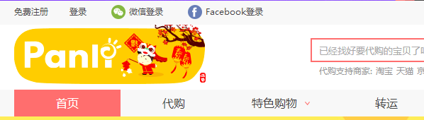

## 一个工作提交日志 1月份

## 2016年1月19日09:37:10 v0.0.7

>app h5 页面去除广告 修复新增的广告

## 签入文件

1. Panli.Site.Static/Ued/H5/elementRemove/js/appcreat.min.js

---

## 2016年1月18日 13:22:35 v0.0.6

>app h5 页面去除广告

## 签入文件

1. Panli.Site.Static/Ued/H5/elementRemove/js/appcreat.min.js

## 浏览器插件测试

[浏览器插件](https://github.com/browser-extensions/appRemove)

---

## 2016年1月12日 09:31:06

> 年货节最后1天弹窗-

之前的弹框时间调整为：截至1月13日0:00

活动最后1天弹框的时间是：1月13日0:00—1月14日0:00  

## 签入文件

1. Panli.Site.Static/Ued/Pc/index/images/layer20160112.png
2. Panli.Site.Static/FrontEnd/js20090801/NewIndex/topBanner.js

## view

---

## 2016年1月8日 11:53:25

> 首页小改动修复bug  母板头文件漏上传

## 签入文件

1. Panli.Site.Static/Ued/Pc/index/build/css/main.min.css
2. oldsite/master/NewsMain.master

---

## 2016年1月5日15:54:23

> h5 遮罩层 阻止穿透点击事件

## 签入文件

> appV = 0.0.4

1. /Panli.Site.Static/Ued/H5/appMask/build/js/main.min.js

---

## 2016年1月4日17:24:07

> 春节logo

## 签入文件

1. /Ued/Pc/header/20160104/images/logo-2016.gif
2. /oldsite/master/NewsMain.master

## view

---