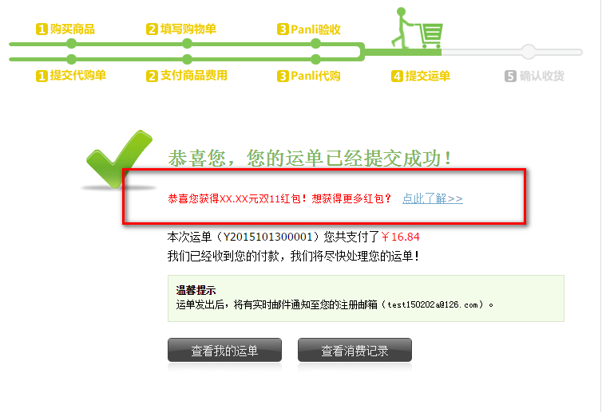
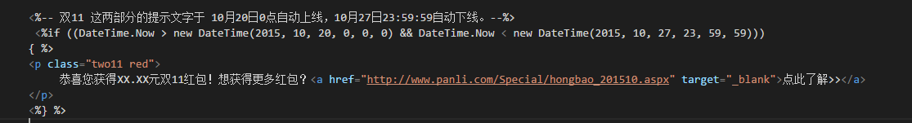

## 一个工作提交日志

### 2015年10月14日10:28:02

最后1天的弹框图片请查收附件，是10月15日0:00—10月16日0:00弹的

提交签入
>http://localhost:45419/Panli.Site.Static/FrontEnd/js20090801/NewIndex/topBanner.js
>http://localhost:45419/Panli.Site.Static/Ued/images/20150927/


### 2015年10月13日10:22:29

双11 这两部分的提示文字于 10月20日0点自动上线，10月27日23:59:59自动下线。

红色画圈为新增部分

http://www.panli.com/mypanli/OrderCart.aspx


http://www.panli.com/mypanli/DeliverType/OrderSuccess.aspx?t=1


提交签入
>http://www.panli.com/mypanli/DeliverType/OrderSuccess.aspx?t=1
>http://www.panli.com/mypanli/OrderCart.aspx

#### 需要后台修改
>红包金额(图中XX.XX元) = 实际支付 的，不含报关费 的 国际运费的5%



```
<%-- 双11 这两部分的提示文字于 10月20日0点自动上线，10月27日23:59:59自动下线。--%>
 <%if ((DateTime.Now > new DateTime(2015, 10, 20, 0, 0, 0) && DateTime.Now < new DateTime(2015, 10, 27, 23, 59, 59)))
{ %>
<p class="two11 red">
     恭喜您获得XX.XX元双11红包！想获得更多红包？<a href="http://www.panli.com/Special/hongbao_201510.aspx" target="_blank">点此了解>></a>
</p>
<%} %>
```

### 2015年10月9日13:11:02

定时10月10日10:00—10月15日0:00，有弹出蒙版宣传页。活动期间用户每天打开首页，只弹1次。
弹出框链接：http://www.panli.com/Special/sale_201510.aspx  （记得做成整个弹窗图片都可以链接到活动页）


提交签入
>http://localhost:45419/Panli.Site.Static/FrontEnd/js20090801/NewIndex/topBanner.js
>http://localhost:45419/Panli.Site.Static/Ued/images/20150927/
